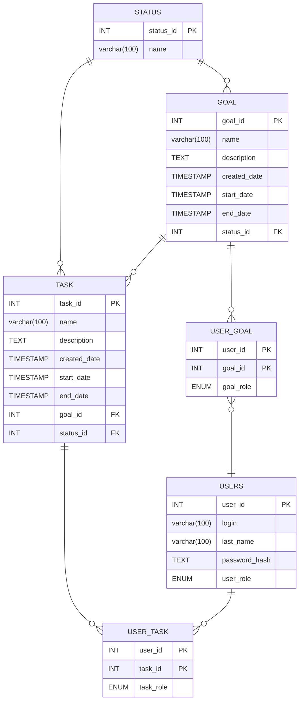
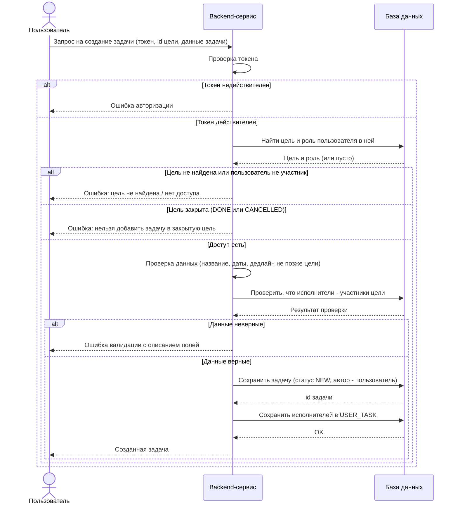
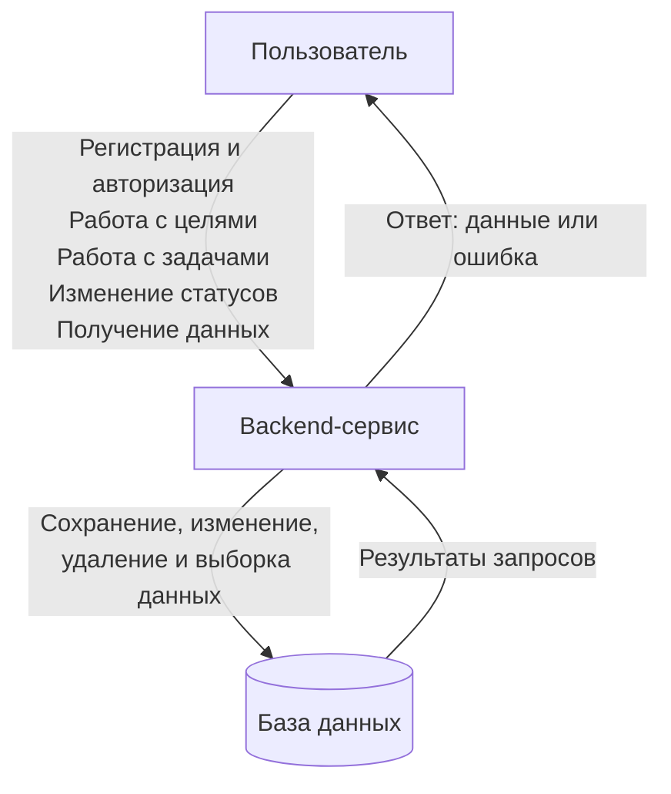

# TManage - Планирование целей и задач

## 1. Назначение системы

* Система помогает пользователю, легко структурировать цели и составлять задачи к ним, с последующим отслеживанием прогресса.
* Системой может пользоваться любой желающий, которому необходимо один раз составить цель и задачи к ней, а затем отслеживать прогресс.
* Составлять цели и задачи к ним и отслеживать прогресс.
* В системе хранятся данные о пользователе, целях, задачах и их состояние.

## 2. Предполагаемые пользователи

* **Пользователь** - зарегистрированный человек. Создает свои цели и задачи, участвует в чужих целях, если его добавили, выполняет назначенные ему задачи. Внутри конкретной цели пользователь может быть владельцем или участником (см. раздел 4).
* **Администратор** - пользователь с ролью `admin`. Может просматривать список пользователей и блокировать/удалять их. В чужие цели и задачи не вмешивается.

Кому подходит система: студентам, людям, которые ставят себе личные цели, и небольшим командам (учебная группа, команда проекта), которым нужно разбить общую цель на задачи и распределить их.

## 3. Описание объектов и их связей

* **Пользователь** (`user`)
* **Цель** (`goal`)
* **Задача** (`task`)
* **Участник цели** (`user_goal`) - связь пользователя и цели с ролью
* **Исполнитель задачи** (`user_task`) - связь пользователя и задачи
* **Статус** - перечисление (`enum`) для целей и задач
---

### Пользователь

Характеристики:

* логин (уникальный);
* пароль (в базе хранится только хеш);
* имя;
* фамилия;
* роль в системе: `user` или `admin`;
* дата регистрации.

### Цель

Характеристики:

* название;
* описание;
* статус;
* дата начала;
* дедлайн;
* дата фактического завершения;
* дата создания;
* дата последнего изменения.

### Задача

Характеристики:

* цель, к которой относится задача;
* автор (кто создал задачу);
* название;
* описание;
* статус;
* дата начала;
* дедлайн;
* дата фактического завершения;
* дата создания;
* дата последнего изменения.

### Участник цели (USER_GOAL)

Связывает пользователя и цель. Хранит роль пользователя в этой цели:

* `owner` - владелец, тот кто создал цель. У цели ровно один владелец;
* `member` - участник, которого владелец добавил в цель.

Зачем нужна отдельная таблица: одна цель может принадлежать нескольким пользователям (владелец + участники), а один пользователь может быть в нескольких целях. Это связь «многие ко многим», поэтому нужна связующая таблица.

### Исполнитель задачи (USER_TASK)

Связывает задачу и пользователя, который должен ее выполнить.

Зачем нужна отдельная таблица: у задачи может быть несколько исполнителей (например, «подготовить презентацию» делают двое), а у пользователя много задач.

Автор задачи хранится прямо в `task` (`author_id`), а не в `user_task`, потому что автор у задачи всегда один.

### Связи

* Пользователь - Цель: многие ко многим через `user_goal`.
* Цель - Задача: один ко многим. Задача всегда относится ровно к одной цели. У цели может быть 0 и больше задач.
* Пользователь - Задача (автор): один ко многим через `task.author_id`.
* Пользователь - Задача (исполнитель): многие ко многим через `user_task`.

## Правила предметной области

**1. Связи user_goal и user_task**

- Цель может принадлежать нескольким пользователям: у нее один владелец `owner` и участники `member`. Поэтому `user_goal` оставили - это связь многие ко многим.
- Владелец цели - пользователь, который ее создал.
- Автор задачи - тот, кто ее создал (владелец или участник цели). Автор всегда один, поэтому он теперь хранится в `task.author_id`, а не в связующей таблице.
- Исполнитель задачи - пользователь, назначенный ее выполнять. Их может быть несколько, поэтому `user_task` оставили, но теперь в ней только исполнители.
- Автор и исполнитель могут быть одним и тем же пользователем, а могут быть разными.

**2. Связь цели и задачи**

- Задача не может существовать без цели.
- Задача относится только к одной цели.
- Цель может существовать без задач.

**3. Статусы**

- У цели и задачи один набор: `new`, `in_progress`, `done`, `cancelled`.
- Отдельную таблицу `status` убрали: набор фиксированный и пользователи его не меняют, так что статус хранится как `enum`.
- Переходы: `new -> in_progress`, `new -> cancelled`, `in_progress -> done`, `in_progress -> cancelled`.
- Обратные переходы разрешены: `in_proggres -> new`, `done -> in_progress` (переоткрыть), `cancelled -> new` (восстановить). Остальные запрещены.
- Цель можно перевести в `done`, только если все ее задачи в `done` или `cancelled`.

**4. Даты**

- `start_date` - плановая дата начала, необязательная.
- `end_date` переименовали в `deadline` - это плановый срок, необязательный.
- `completed_at` - фактическая дата завершения, ставится системой при переходе в `DONE`.
- `updated_at` - дата последнего изменения, обновляется автоматически.
- `created_at` - дата создания, ставится автоматически.

**5. Права пользователей**

- Цель редактирует, удаляет и меняет ее статус только владелец.
- Задачу редактирует ее автор или владелец цели.
- Статус задачи может менять владелец цели, автор или исполнитель.
- Исполнителей может менять владелец цели или автор задачи. Назначить исполнителем можно только участника этой цели.
- Пользователь видит цели, где он владелец или участник, и все задачи этих целей. Назначенные ему задачи он тоже видит, потому что исполнитель всегда является участником цели.

**6. Удаление**

- При удалении цели удаляются все ее задачи, назначения исполнителей и участники (каскадно). Удалять может только владелец.
- При удалении задачи удаляются ее назначения исполнителей.
- При удалении пользователя: его цели (где он владелец) удаляются вместе с задачами, из чужих целей он удаляется как участник, созданные им задачи в чужих целях остаются с пустым `author_id`, его назначения исполнителем удаляются.

**7. Обязательность полей**

- Цель без описания создать можно.
- Цель без дедлайна создать можно.
- Задачу без исполнителя создать можно, назначить его можно позже.
- Задачу без дедлайна создать можно. Если дедлайн указан, он не может быть позже дедлайна цели.
- Названия целей и задач могут повторяться. Уникален только логин пользователя.


## 4. ER-диаграмма



Что поменялось по сравнению с прошлой версией:

* таблица `status` убрана, статус стал `enum` (см. правила про статусы);
* `end_date` переименован в `deadline`, чтобы было понятно, что это плановый срок;
* добавлены `completed_at` и `updated_at`;
* в `users` добавлено имя (`first_name`), логин уникальный;
* автор задачи вынесен в `task.author_id`, в `user_task` остались только исполнители.

## 5. Правила предметной области

### Цели и задачи

* Задача не может существовать без цели.
* Задача относится только к одной цели.
* Цель может существовать без задач (например, только что созданная).
* Прогресс цели не хранится в базе, а считается при запросе: `выполненные задачи / все задачи, кроме отмененных`.

### Статусы

Для целей и задач используется один и тот же набор статусов:

* `new` - создана, работа не начата;
* `in_progress` - в работе;
* `done` - выполнена;
* `cancelled` - отменена.

Отдельная таблица для статусов не нужна: набор фиксированный, пользователи его не меняют, а правила переходов все равно проверяются в коде. Поэтому статус хранится как `ENUM`.

Допустимые переходы:

```
new         -> in_progress
new         -> cancelled
in_progress -> done
in_progress -> cancelled
in_progress -> new          (вернуть задачу, если начали по ошибке)
done        -> in_progress  (переоткрыть)
cancelled   -> new          (восстановить)
```

Остальные переходы запрещены, например сразу `new -> done` нельзя.

Дополнительно:

* при переходе в `done` система записывает `completed_at`, при переоткрытии очищает его;
* цель можно перевести в `done`, только если все ее задачи в статусе `done` или `cancelled`;
* в отмененную или выполненную цель нельзя добавлять новые задачи.

### Даты

* `created_at` - когда запись создана, ставится системой автоматически.
* `updated_at` - когда запись последний раз менялась, обновляется системой автоматически.
* `start_date` - плановая дата начала работы, указывает пользователь. Необязательная.
* `deadline` - плановый срок, до которого нужно закончить. Необязательный.
* `completed_at` - фактическая дата завершения, ставится системой при переходе в `done`.
* `start_date` не может быть позже `deadline`.
* Дедлайн задачи не может быть позже дедлайна ее цели (если у цели он указан).

### Права пользователей

Видимость:

* пользователь видит только те цели, где он владелец или участник, и все задачи этих целей;
* задачи, назначенные пользователю, он видит всегда, т.к. исполнителем можно назначить только участника цели;
* чужие цели и задачи недоступны, система возвращает ошибку.

Кто что может:

| Действие | Владелец цели | Участник цели | Исполнитель задачи |
|---|---|---|---|
| Редактировать и удалять цель, менять ее статус | да | нет | - |
| Добавлять и удалять участников цели | да | нет | - |
| Создавать задачи в цели | да | да | - |
| Редактировать и удалять задачу | да | только свои (автор) | нет |
| Назначать и менять исполнителей | да | только в своих задачах | нет |
| Менять статус задачи | да | если он автор | да |

* Исполнителем можно назначить только владельца или участника этой цели.
* Владелец не может удалить себя из цели.
* Администратор управляет пользователями, но не редактирует их цели и задачи.

### Удаление

* **Удаление цели** - только владельцем. Вместе с целью удаляются все ее задачи, назначения исполнителей и список участников (каскадное удаление). Перед удалением API возвращает количество задач, которые удалятся, чтобы клиент мог спросить подтверждение.
* **Удаление задачи** - автором или владельцем цели. Удаляются назначения исполнителей этой задачи.
* **Удаление пользователя** (сам удаляет аккаунт или администратор):
  * цели, где он владелец, удаляются вместе с задачами;
  * из чужих целей он удаляется как участник;
  * задачи, которые он создал в чужих целях, остаются, `author_id` становится пустым;
  * назначения его исполнителем удаляются.
* **Удаление участника из цели** - его назначения на задачи этой цели снимаются, созданные им задачи остаются.

### Обязательные поля

| Поле | Обязательно |
|---|---|
| Логин, пароль, имя | да |
| Фамилия | нет |
| Название цели | да (от 1 до 100 символов) |
| Описание цели | нет |
| Дата начала и дедлайн цели | нет |
| Цель задачи | да |
| Название задачи | да (от 1 до 100 символов) |
| Описание задачи | нет |
| Исполнитель задачи | нет, можно назначить позже |
| Дата начала и дедлайн задачи | нет |

* Логин уникальный, двух пользователей с одинаковым логином быть не может.
* Названия целей и задач могут повторяться, записи различаются по id.
* Статус при создании всегда `new`, пользователь его не передает.

## 6. Пользовательские сценарии

### Регистрация

1. Гость вводит логин, пароль, имя и фамилию.
2. Система проверяет, что обязательные поля заполнены и пароль не короче 8 символов.
3. Система проверяет, что логин не занят.
4. Система сохраняет пользователя с ролью `user`, пароль сохраняет в виде хеша.
5. Система возвращает данные созданного пользователя (без пароля).

Ошибки: не заполнены поля или короткий пароль - ошибка валидации; логин занят - ошибка «логин уже существует».

### Авторизация

1. Пользователь вводит логин и пароль.
2. Система ищет пользователя по логину.
3. Система сравнивает хеш введенного пароля с хешем из базы.
4. Система возвращает токен доступа, который пользователь передает в следующих запросах.

Ошибки: неверный логин или пароль - ошибка авторизации (без уточнения, что именно неверно); пользователь заблокирован - доступ запрещен.

### Создание цели

1. Пользователь авторизуется.
2. Пользователь вводит название цели, при желании описание, дату начала и дедлайн.
3. Система проверяет токен.
4. Система проверяет данные: название заполнено, `start_date` не позже `deadline`.
5. Система сохраняет цель со статусом `new` и записывает пользователя в `user_goal` с ролью `owner`.
6. Система возвращает созданную цель.

Ошибки: нет токена или он недействителен - ошибка авторизации; неверные данные - ошибка валидации с описанием поля.

### Создание задачи

1. Пользователь авторизуется.
2. Пользователь выбирает существующую цель.
3. Пользователь вводит данные задачи: название, при желании описание, даты и исполнителей.
4. Система проверяет токен.
5. Система проверяет, что цель существует и пользователь - ее владелец или участник.
6. Система проверяет, что цель не в статусе `done` или `cancelled`.
7. Система проверяет данные задачи: название заполнено, даты корректны, дедлайн не позже дедлайна цели, исполнители - участники цели.
8. Система сохраняет задачу со статусом `new`, автором ставит текущего пользователя, сохраняет исполнителей в `user_task`.
9. Система возвращает созданную задачу.

Ошибки: цель не найдена; нет доступа к цели; цель закрыта; неверные данные; исполнитель не участник цели.

### Изменение статуса задачи

1. Пользователь выбирает задачу и новый статус.
2. Система проверяет токен и права: пользователь владелец цели, автор или исполнитель задачи.
3. Система проверяет, что переход допустим (см. правила про статусы).
4. Система сохраняет статус, обновляет `updated_at`, при переходе в `done` записывает `completed_at`.
5. Система возвращает обновленную задачу.

Ошибки: задача не найдена; нет прав; недопустимый переход статуса.

### Добавление участника в цель

1. Владелец выбирает цель и вводит логин пользователя.
2. Система проверяет, что текущий пользователь - владелец цели.
3. Система ищет пользователя по логину и проверяет, что он еще не участник.
4. Система сохраняет запись в `user_goal` с ролью `member`.
5. Система возвращает обновленный список участников.

Ошибки: нет прав; пользователь не найден; пользователь уже участник.

### Просмотр целей и прогресса

1. Пользователь запрашивает список своих целей.
2. Система проверяет токен.
3. Система выбирает цели, где пользователь владелец или участник, и для каждой считает прогресс по задачам.
4. Система возвращает список целей с прогрессом.

## 7. Sequence-диаграмма (создание задачи)



## 8. Общая схема системы


