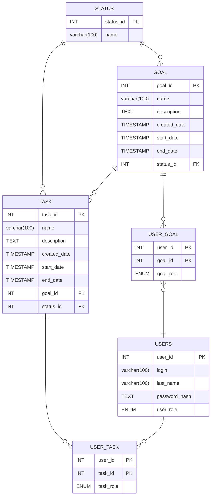

# TManage - Планирование целей и задач

### 1. Назначение системы.

* Система помогает пользователю, легко структурировать цели и составлять задачи к ним, с последующим отслеживанием прогресса.
* Системой может пользоваться любой желающий, которому необходимо один раз составить цель и задачи к ней, а затем отслеживать прогресс.
* Составлять цели и задачи к ним и отслеживать прогресс.
* В системе хранятся данные о пользователе, целях, задачах и их состояние.

### 2\. Основные объекты системы.

Пользователь
---
Характеристики: 

* имя;
* фамилия;
* логин.

Связи:

* Пользователь может создавать цели и задачи.
* Пользователь может редактировать, цели и задачи.
* Пользователь может получать список задач и целей.

Цель
---
Характеристики:

* Название
* Описание
* Статус
* Дедлайн
* Дата создания

Связи:

* Цель связана с пользователем и задачей

Задача
---
Характеристики:

* Название
* Описание
* Статус
* Дедлайн
* Дата создания

Связи:

* Задача связана с пользователем и целью

### 3\. ER-диаграмма

### 4\. Сценарий использования

Сценарий: авторизация
1. Пользователь вводит логин и пароль
2. Пользователь отправляет запрос на авторизацию

Сценарий: создание цели
1. Пользователь авторизуется
2. Пользователь вводит необходимые данные для цели
3. Сохраняет цель

Сценарий: создание задачи
1. Пользователь авторизуется
2. Пользователь создает цель
3. Пользователь вводит необходимые данные для создания задания внутри цели
4. Сохраняет задачу

### 5\. Диаграмма последовательности.

### 6\. Общая блок-схема.

User [Пользователь]

APP [Backend-сервис]

Data [База данных]

User --> APP (Запросы: авторизация, цели, задачи)

APP --> Data (Чтение и запись метаданных)

Data --> APP (Результаты проверок и выборки)

APP --> User (Данные хранилища)
