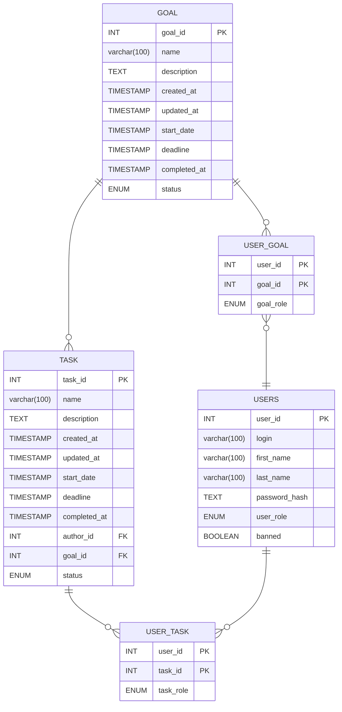
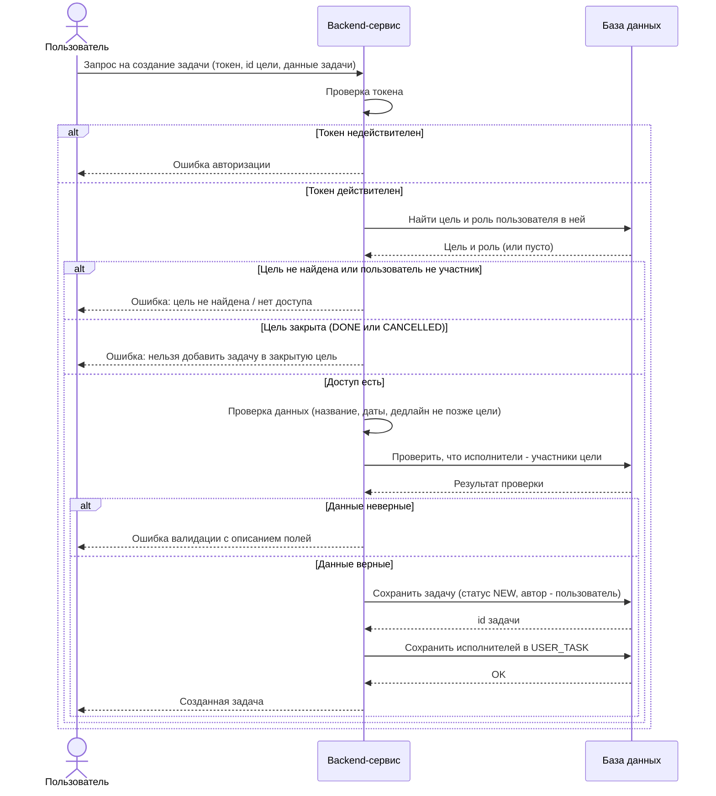
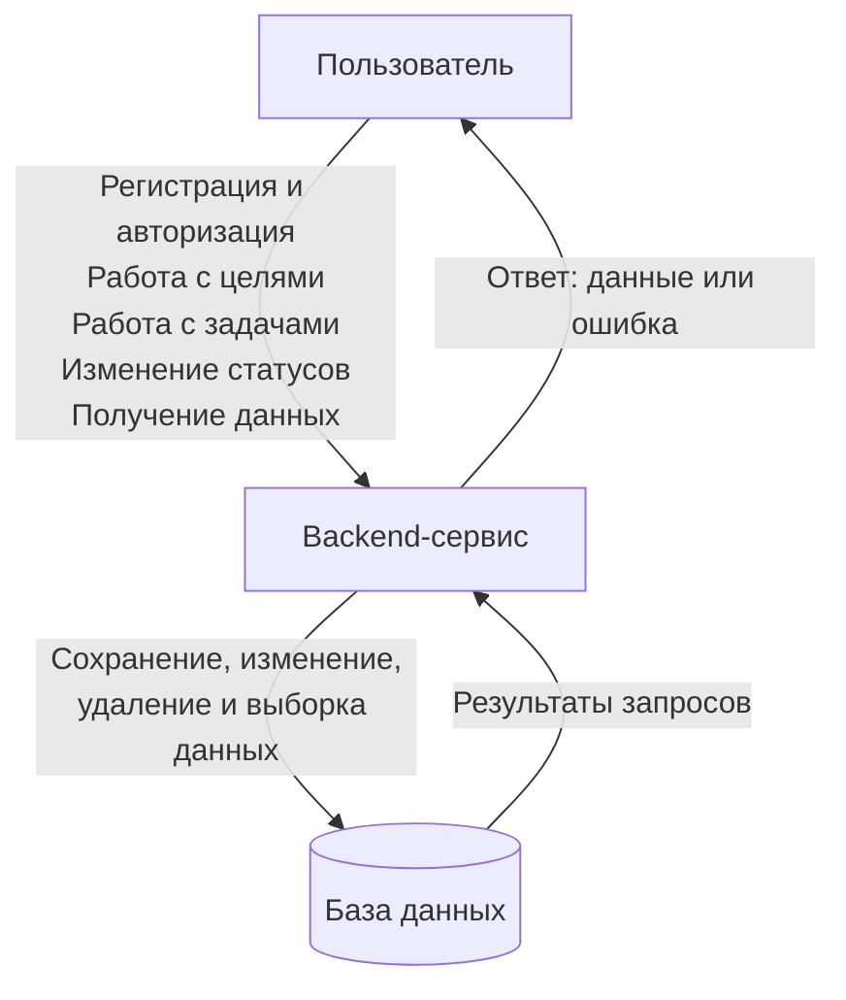

# TManage - Планирование целей и задач

## 1. Назначение системы

* Система помогает пользователю, легко структурировать цели и составлять задачи к ним, с последующим отслеживанием прогресса.
* Системой может пользоваться любой желающий, которому необходимо один раз составить цель и задачи к ней, а затем отслеживать прогресс.
* Составлять цели и задачи к ним и отслеживать прогресс.
* В системе хранятся данные о пользователе, целях, задачах и их состояние.

## 2. Предполагаемые пользователи

* **Пользователь** - зарегистрированный человек. Создает свои цели и задачи, участвует в чужих целях, если его добавили, выполняет назначенные ему задачи. Внутри конкретной цели пользователь может быть владельцем или участником (см. раздел 4).
* **Администратор** - пользователь с ролью `admin`. Может просматривать список пользователей и блокировать/удалять их. В чужие цели и задачи не вмешивается.

Кому подходит система: студентам, людям, которые ставят себе личные цели, и небольшим командам (учебная группа, команда проекта), которым нужно разбить общую цель на задачи и распределить их.

## 3. Описание объектов и их связей

* **Пользователь** (`user`)
* **Цель** (`goal`)
* **Задача** (`task`)
* **Участник цели** (`user_goal`) - связь пользователя и цели с ролью
* **Исполнитель задачи** (`user_task`) - связь пользователя и задачи
* **Статус** - перечисление (`enum`) для целей и задач
* **Роли** - перечисление (`enum`) для пользователей, целей и задач
---

### Пользователь

Характеристики:

* логин (уникальный);
* пароль (в базе хранится только хеш);
* имя;
* фамилия;
* роль в системе: `user` или `admin`;
* дата регистрации;
* Забанен, да или нет.

### Цель

Характеристики:

* название;
* описание;
* статус;
* дата начала;
* дедлайн;
* дата фактического завершения;
* дата создания;
* дата последнего изменения.

### Задача

Характеристики:

* цель, к которой относится задача;
* автор (кто создал задачу);
* название;
* описание;
* статус;
* дата начала;
* дедлайн;
* дата фактического завершения;
* дата создания;
* дата последнего изменения.

### Участник цели (USER_GOAL)

Связывает пользователя и цель. Хранит роль пользователя в этой цели:

* `owner` - владелец, тот кто создал цель. У цели ровно один владелец;
* `moderator` - модератор, тот кто следит за порядком выполнения цели; 
* `member` - участник, которого владелец добавил в цель.

Зачем нужна отдельная таблица: одна цель может принадлежать нескольким пользователям (владелец + участники), а один пользователь может быть в нескольких целях. Это связь «многие ко многим», поэтому нужна связующая таблица.

### Исполнитель задачи (USER_TASK)

Связывает задачу и пользователя, который должен ее выполнить.

Зачем нужна отдельная таблица: у задачи может быть несколько исполнителей (например, «подготовить презентацию» делают двое), а у пользователя много задач.

Автор задачи хранится прямо в `task` (`author_id`), а не в `user_task`, потому что автор у задачи всегда один.

### Связи

* Пользователь - Цель: многие ко многим через `user_goal`.
* Цель - Задача: один ко многим. Задача всегда относится ровно к одной цели. У цели может быть 0 и больше задач.
* Пользователь - Задача (автор): один ко многим через `task.author_id`.
* Пользователь - Задача (исполнитель): многие ко многим через `user_task`.
  
## 4. ER-диаграмма

```mermaid
erDiagram
    TASK ||--o{ USER_TASK : " "
    USERS ||--o{ USER_TASK : " "
    GOAL ||--o{ USER_GOAL : " "
    USER_GOAL }o--|| USERS : " "
    GOAL ||--o{ TASK : ""

  USERS {
      INT user_id PK
      varchar(100) login
      varchar(100) first_name
      varchar(100) last_name
      TEXT password_hash
      ENUM user_role
      BOOLEAN banned
  }
  
  GOAL {
      INT goal_id PK
      varchar(100) name
      TEXT description
      TIMESTAMP created_at
      TIMESTAMP updated_at
      TIMESTAMP start_date
      TIMESTAMP deadline
      TIMESTAMP completed_at
      ENUM status
  }
  
  TASK {
      INT task_id PK
      varchar(100) name
      TEXT description
      TIMESTAMP created_at
      TIMESTAMP updated_at
      TIMESTAMP start_date
      TIMESTAMP deadline
      TIMESTAMP completed_at
      INT author_id FK
      INT goal_id FK
      ENUM status
  }
  
  USER_TASK {
      INT user_id PK
      INT task_id PK
      ENUM task_role
  }
  
  USER_GOAL {
      INT user_id PK
      INT goal_id PK
      ENUM goal_role
  }
```

Что поменялось по сравнению с прошлой версией:

* таблица `status` убрана, статус стал `enum` (см. правила про статусы);
* `end_date` переименован в `deadline`, чтобы было понятно, что это плановый срок;
* добавлены `completed_at` и `updated_at`;
* в `users` добавлено имя (`first_name`), логин уникальный;
* автор задачи вынесен в `task.author_id`, в `user_task` остались только исполнители.

## 5. Правила предметной области

**1. Связи user_goal и user_task**

- Цель может принадлежать нескольким пользователям: у нее один владелец `owner`, модераторы `moderator` и участники `member`. Поэтому `user_goal` оставили - это связь многие ко многим.
- Владелец цели - пользователь, который ее создал.
- Модератор цели - пользователь, назначенный владельцем, его задача следить за порядком выполнения цели.
- Автор задачи - тот, кто ее создал (владелец или модератор цели). Автор всегда один, поэтому он теперь хранится в `task.author_id`, а не в связующей таблице.
- Исполнитель задачи - пользователь, назначенный ее выполнять. Их может быть несколько, поэтому `user_task` оставили, но теперь в ней только исполнители.
- Автор и исполнитель могут быть одним и тем же пользователем, а могут быть разными.

**2. Связь цели и задачи**

- Задача не может существовать без цели.
- Задача относится только к одной цели.
- Цель может существовать без задач.

**3. Статусы**

- У цели и задачи один набор: `new`, `in_progress`, `done`, `cancelled`.
- Отдельную таблицу `status` убрали: набор фиксированный и пользователи его не меняют, так что статус хранится как `enum`.
- Переходы: `new -> in_progress`, `new -> cancelled`, `in_progress -> done`, `in_progress -> cancelled`.
- Обратные переходы разрешены: `in_proggres -> new`, `done -> in_progress` (переоткрыть), `cancelled -> new` (восстановить). Остальные запрещены.
- Цель можно перевести в `done`, только если все ее задачи в `done` или `cancelled`.

**4. Даты**

- `start_date` - плановая дата начала, необязательная.
- `end_date` переименовали в `deadline` - это плановый срок, необязательный.
- `completed_at` - фактическая дата завершения, ставится системой при переходе в `DONE`.
- `updated_at` - дата последнего изменения, обновляется автоматически.
- `created_at` - дата создания, ставится автоматически.

**5. Права пользователей**

- Цель редактирует и меняет ее статус владелец и модератор. Удалить цель может только владелец.
- Задачу редактирует, удаляет владелец, модератор и ее автор.
- Статус задачи может менять владелец, модератор, автор задачи и исполнитель.
- Исполнителей может менять владелец, модератор цели или автор задачи. Назначить исполнителем можно только участника этой цели.
- Пользователь видит цели, где он владелец, модератор или участник, все задачи этих целей видят только владелец и модератор, участник видит только задачи где он является исполнителем (исполнитель это всегда участник цели). 

**6. Удаление**

- При удалении цели удаляются все ее задачи, назначения исполнителей и участники (каскадно). Удалять может только владелец.
- При удалении задачи удаляются ее назначения исполнителей.
- При удалении пользователя: его цели (где он владелец) удаляются вместе с задачами, из чужих целей он удаляется как участник, созданные им задачи в чужих целях остаются с пустым `author_id`, его назначения исполнителем удаляются.

**7. Обязательность полей**

- Цель без описания создать можно.
- Цель без дедлайна создать можно.
- Задачу без исполнителя создать можно, назначить его можно позже.
- Задачу без дедлайна создать можно. Если дедлайн указан, он не может быть позже дедлайна цели.
- Названия целей и задач могут повторяться. Уникален только логин пользователя.

## 6. Пользовательские сценарии

### Регистрация

1. Гость вводит логин, пароль, имя и фамилию.
2. Система проверяет, что обязательные поля заполнены и пароль не короче 8 символов.
3. Система проверяет, что логин не занят.
4. Система сохраняет пользователя с ролью `user`, пароль сохраняет в виде хеша.
5. Система возвращает данные созданного пользователя (без пароля).

Ошибки: не заполнены поля или короткий пароль - ошибка валидации; логин занят - ошибка «логин уже существует».

### Авторизация

1. Пользователь вводит логин и пароль.
2. Система ищет пользователя по логину.
3. Система сравнивает хеш введенного пароля с хешем из базы.
4. Система возвращает токен доступа, который пользователь передает в следующих запросах.

Ошибки: неверный логин или пароль - ошибка авторизации (без уточнения, что именно неверно); пользователь заблокирован - доступ запрещен.

### Создание цели

1. Пользователь вводит название цели, при желании описание, дату начала и дедлайн.
2. Система проверяет токен.
3. Система проверяет данные: название заполнено, `start_date` не позже `deadline`.
4. Система сохраняет цель со статусом `new` и записывает пользователя в `user_goal` с ролью `owner`.
5. Система возвращает созданную цель.

Ошибки: нет токена или он недействителен - ошибка авторизации; неверные данные - ошибка валидации с описанием поля.

### Создание задачи

1. Пользователь выбирает цель и вводит данные задачи: название, при желании описание, даты и исполнителей.
2. Система проверяет токен.
3. Система проверяет, что цель существует и пользователь - ее владелец или модератор.
4. Система проверяет, что цель не в статусе `done` или `cancelled`.
5. Система проверяет данные задачи: название заполнено, `start_date` не позже `deadline`, дедлайн не позже дедлайна цели, исполнители - участники цели.
6. Система сохраняет задачу со статусом `new`, автором ставит текущего пользователя, сохраняет исполнителей в `user_task`.
7. Система возвращает созданную задачу.

Ошибки: цель не найдена; нет прав (пользователь не владелец и не модератор); цель закрыта; неверные данные; исполнитель не участник цели.

### Изменение статуса задачи

1. Пользователь выбирает задачу и новый статус.
2. Система проверяет токен.
3. Система проверяет права: пользователь владелец или модератор цели, автор или исполнитель задачи.
4. Система проверяет, что переход допустим (см. правила про статусы).
5. Система сохраняет статус и обновляет `updated_at`. При переходе в `done` записывает `completed_at`, при переоткрытии очищает его.
6. Система возвращает обновленную задачу.

Ошибки: задача не найдена; нет прав; недопустимый переход статуса.

### Добавление участника в цель

1. Владелец выбирает цель и вводит логин пользователя.
2. Система проверяет токен и что текущий пользователь - владелец цели.
3. Система ищет пользователя по логину и проверяет, что он еще не в этой цели.
4. Система сохраняет запись в `user_goal` с ролью `member`.
5. Система возвращает обновленный список участников.

Ошибки: нет прав; пользователь не найден; пользователь уже в цели.

### Назначение модератора

1. Владелец выбирает цель и участника, которого хочет сделать модератором.
2. Система проверяет токен и что текущий пользователь - владелец цели.
3. Система проверяет, что выбранный пользователь состоит в цели с ролью `member`.
4. Система меняет его роль в `user_goal` на `moderator`.
5. Система возвращает обновленный список участников.

Ошибки: нет прав; пользователь не состоит в цели.

### Просмотр целей и прогресса

1. Пользователь запрашивает список своих целей.
2. Система проверяет токен.
3. Система выбирает цели, где пользователь владелец, модератор или участник.
4. Для каждой цели система считает прогресс: выполненные задачи / все задачи, кроме отмененных.
5. Система возвращает список целей с прогрессом.

### Просмотр задач цели

1. Пользователь выбирает цель.
2. Система проверяет токен и роль пользователя в цели.
3. Если пользователь владелец или модератор - система возвращает все задачи цели.
4. Если пользователь участник - система возвращает только задачи, где он исполнитель.

Ошибки: цель не найдена или пользователь не состоит в ней - ошибка доступа.

## 7. Sequence-диаграмма (создание задачи)

```mermaid
sequenceDiagram
    actor U as Пользователь
    participant B as Backend-сервис
    participant D as База данных

    U->>B: Запрос на создание задачи (токен, id цели, данные задачи)
    B->>B: Проверка токена

    alt Токен недействителен
        B-->>U: Ошибка авторизации
    else Токен действителен
        B->>D: Найти цель и роль пользователя в ней
        D-->>B: Цель и роль (или пусто)

        alt Цель не найдена или пользователь не участник
            B-->>U: Ошибка: цель не найдена / нет доступа
        else Цель закрыта (DONE или CANCELLED)
            B-->>U: Ошибка: нельзя добавить задачу в закрытую цель
        else Доступ есть
            B->>B: Проверка данных (название, даты, дедлайн не позже цели)
            B->>D: Проверить, что исполнители - участники цели
            D-->>B: Результат проверки

            alt Данные неверные
                B-->>U: Ошибка валидации с описанием полей
            else Данные верные
                B->>D: Сохранить задачу (статус NEW, автор - пользователь)
                D-->>B: id задачи
                B->>D: Сохранить исполнителей в USER_TASK
                D-->>B: OK
                B-->>U: Созданная задача
            end
        end
    end
```

## 8. Общая схема системы

```mermaid
flowchart TD
    U[Пользователь]
    B[Backend-сервис]
    D[(База данных)]

    U -- "Регистрация и авторизация<br>Работа с целями<br>Работа с задачами<br>Изменение статусов<br>Получение данных" --> B
    B -- "Ответ: данные или ошибка" --> U
    B -- "Сохранение, изменение,<br>удаление и выборка данных" --> D
    D -- "Результаты запросов" --> B
```
